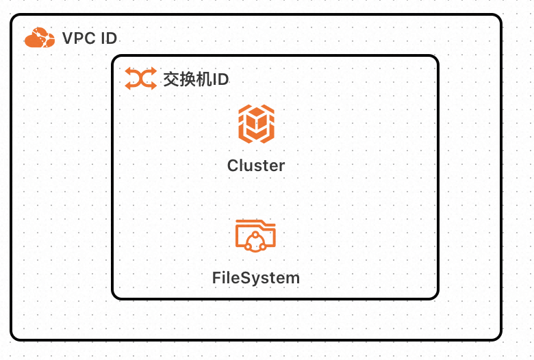
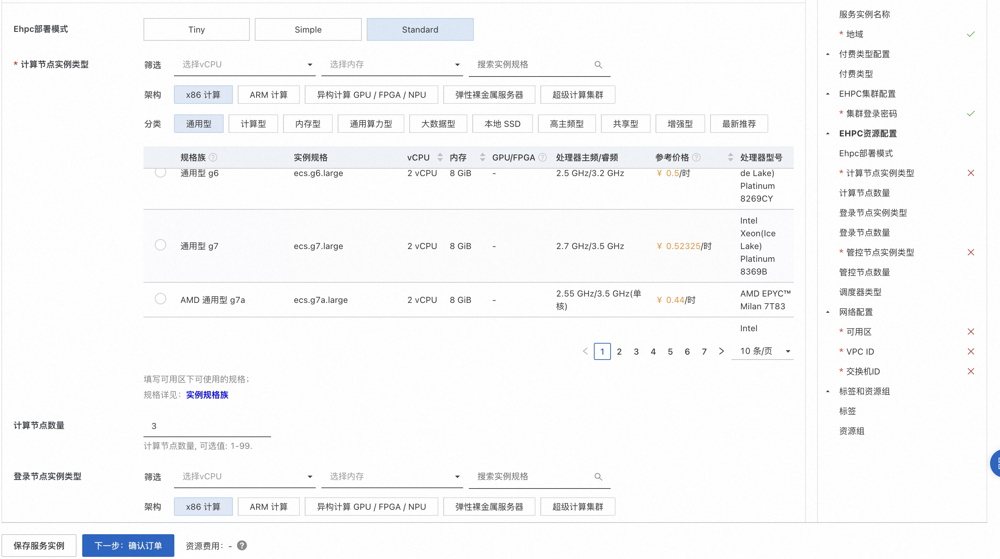
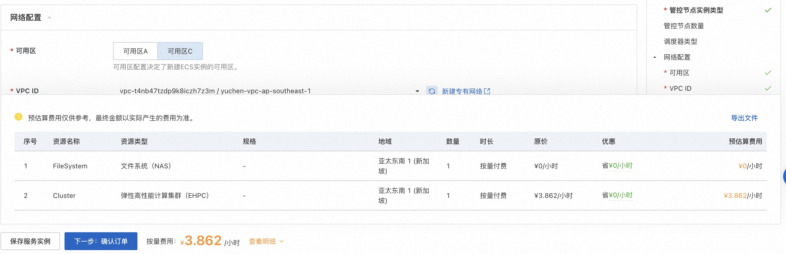
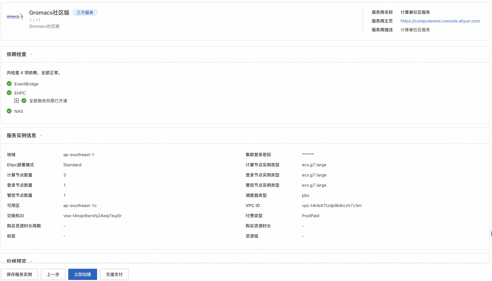
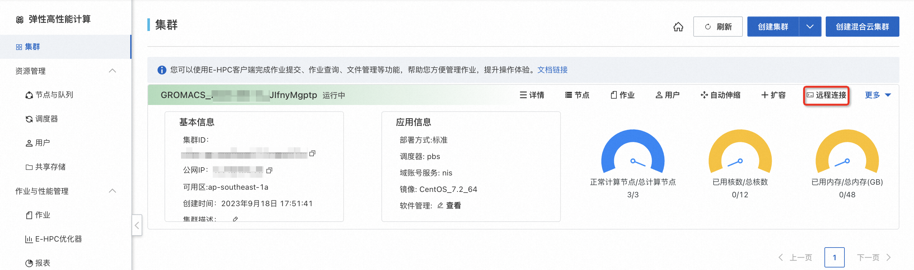
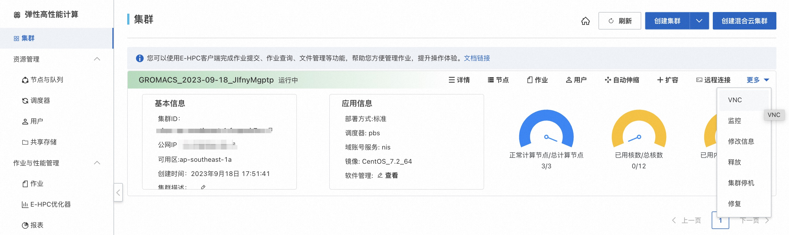
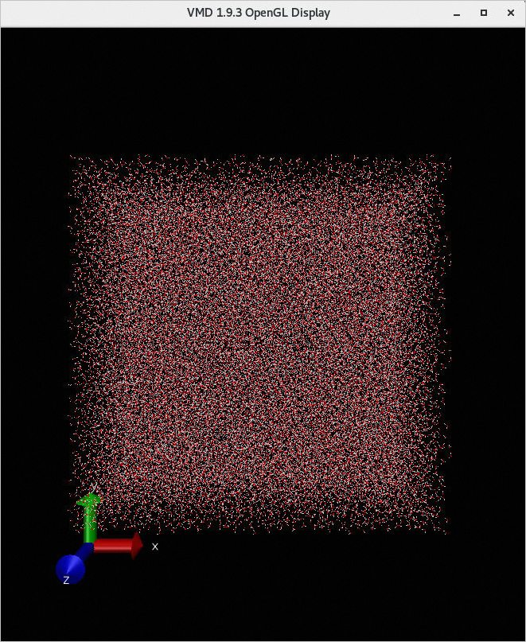

<h1> Rapid deployment Gromacs Ehpc compute nest </h1>

<blockquote>

<strong> Disclaimer:</strong> This service is provided by a third party. We try our best to ensure its security, accuracy and reliability, but we cannot guarantee that it is completely free from failure, interruption, error or attack. Therefore, the company hereby declares that it makes no representations, warranties or commitments regarding the content, accuracy, completeness, reliability, suitability and timeliness of the Service and is not liable for any direct or indirect loss or damage arising from your use of the Service; for third-party websites, applications, products and services that you access through the Service, do not assume any responsibility for its content, accuracy, completeness, reliability, applicability and timeliness, and you shall bear the risks and responsibilities of the consequences of use; for any loss or damage arising from your use of this service, including but not limited to direct loss, indirect loss, loss of profits, loss of goodwill, loss of data or other economic losses, even if we have been advised in advance of the possibility of such loss or damage; we reserve the right to amend this statement from time to time, so please check this statement regularly before using the Service. If you have any questions or concerns about this Statement or the Service, please contact us. 

</blockquote>

<h2> Overview </h2>

GROMACS(GROningen MAchine for Chemical Simulations) is a general-purpose software used to perform molecular dynamics simulations based on Newton's equations of motion for systems with millions of particles.
GROMACS are mainly used for biochemical molecules, such as proteins, lipids and other nucleic acid analysis with a variety of complex binding interactions. GROMACS computing is typically used in simulation applications, such as the efficient calculation of non-bonding interactions, which many researchers use to study polymers in non-biological systems.
GROMACS common algorithms that support molecular dynamics, GPUs can be employed to accelerate the core computing process. For more information, see <a href = "https://www.gromacs.org/">GROMACS </a>.
This article describes how to use the compute nest to quickly deploy Gromacs. 

<h2> Prerequisites </h2>

 To deploy Gromacs community edition service instances, you need to access and create some Alibaba Cloud resources. Therefore, your account must contain permissions for the following resources.
<strong> Note </strong>: This permission is required only when your account is a RAM account. 

<table>
<thead>
<tr>
<th> Permission policy name </th>
<th> Remarks </th>
</tr>
</thead>
<tbody>
<tr>
<td>AliyunECSFullAccess</td>
<td> Permissions to manage ECS </td>
</tr>
<tr>
<td>AliyunEHPCFullAccess</td>
<td> Permissions to manage Elastic High Performance Computing (EHPC) </td>
</tr>
<tr>
<td>AliyunNASFullAccess</td>
<td> Manage NAS permissions </td>
</tr>
<tr>
<td>AliyunVPCFullAccess</td>
<td> Permissions for managing VPC networks </td>
</tr>
<tr>
<td>AliyunROSFullAccess</td>
<td> Manage permissions for Resource Orchestration Services (ROS) </td>
</tr>
<tr>
<td>AliyunComputeNestUserFullAccess</td>
<td> Manage user-side permissions for the compute nest service (ComputeNest) </td>
</tr>
</tbody>
</table>

<h2> Billing instructions </h2>

 the cost of Gromacs community edition deployment in computing nest mainly involves:

<ul>
<li> Elastic High Performance Computing Cluster (EHPC) fees </li>
<li> File System (NAS) fees </li>
<li> Traffic bandwidth charges </li>
</ul>

<h2> Deployment Architecture </h2>

<ul>
<li> The deployment consists of an ehpc cluster, which includes manager nodes, schedule nodes, and compute nodes. </li>
<li> The service uses nas-cpfs to build a high-performance shared file system </li>
</ul>

<h2> Parameter description </h2>

<table>
<thead>
<tr>
<th> Parameter group </th>
<th> Parameter item </th>
<th> Description </th>
</tr>
</thead>
<tbody>
<tr>
<td> Service instance </td>
<td> Service instance name </td>
<td> It must be no more than 64 characters in length and must start with an English letter. It can contain numbers, English letters, dashes (-), and underscores (_). </td>
</tr>
<tr>
<td></td>
<td> Region </td>
<td> Region where the service instance is deployed </td>
</tr>
<tr>
<td></td>
<td> Payment type </td>
<td> Billing type of resources: pay by two and package year and month. </td>
</tr>
<tr>
<td>EHPC cluster configuration </td>
<td> Cluster logon password </td>
<td> is 8-30 in length and must contain three items (uppercase letters, lowercase letters, numbers, ()'~!@#$%^& *-+ =|{}[]:' <>,./special symbols)</td>
</tr>
<tr>
<td></td>
<td>Ehpc deployment mode </td>
<td>Tiny,Simple,Standard</td>
</tr>
<tr>
<td></td>
<td> Compute node instance type </td>
<td> Specifications of compute nodes available in the zone </td>
</tr>
<tr>
<td></td>
<td> Calculate the number of nodes </td>
<td> Number of computing nodes, optional value: 1-99</td>
</tr>
<tr>
<td></td>
<td> Login node instance type </td>
<td> Specifications of logon nodes available in the zone </td>
</tr>
<tr>
<td></td>
<td> Number of control nodes </td>
<td> Number of control nodes, optional values: 1,2,4</td>
</tr>
<tr>
<td>EHPC cluster user configuration </td>
<td> User password </td>
<td> is 8-30 in length and must contain three items (uppercase letters, lowercase letters, numbers, ()~!@#$%^& *-_+ =|{}[]:;'/<>,./special symbols)</td>
</tr>
<tr>
<td></td>
<td> User Name </td>
<td> The user name used to log on to the cluster. Default value: gromacs</td>
</tr>
<tr>
<td> Network configuration </td>
<td> Availability Zone </td>
<td> Zone where the ECS instance is located </td>
</tr>
<tr>
<td></td>
<td>VPC ID</td>
<td> VPC where the resource is located </td>
</tr>
<tr>
<td></td>
<td> Switch ID</td>
<td> Switch where the resource is located </td>
</tr>
</tbody>
</table>

<h2> Deployment process </h2>

<ol>
<li>
 Visit Compute Nest Gromacs Community Edition <a href = "https://computenest.console.aliyun.com/user/cn-hangzhou/serviceInstanceCreate?ServiceId=service-a44c0fa4bf4947278642"> Deployment link </a>
, fill in the deployment parameters as prompted:

</li>
<li>
 after the parameters are filled in, you can see the corresponding inquiry details. after confirming the parameters, click <strong> next: confirm the order </strong>.

</li>
<li>
 Confirm the order and agree to the service agreement and click <strong> Create now </strong>
Enter the deployment phase.

</li>
</ol>

<h2> Using Process </h2>

<h3> Step 1: Connect to the cluster through the console </h3>

<ol>
<li> Log on to the <a href = "https://ehpc.console.aliyun.com"> Elastic HPC console </a>. </li>
<li> In the top-left corner of the menu bar, select a region. </li>
<li> In the left-side navigation pane, click <strong> Clusters </strong>. </li>
<li>
 On the <strong> Clusters </strong> page, find the target cluster deployed in the computing nest and click <strong> Remote Connection </strong>.

</li>
<li>
 On the <strong> Remote Connection </strong> page, enter the cluster username, login password, and port number, and click <strong>ssh Connection </strong>. 
</li>
</ol>

<h3><strong> Step 2: Submit the job </strong></h3>

<ol>
<li>
 Run the following command to download and decompress the example. This paper uses the motion of water molecules as an example. 

wget https://public-ehpc-package.oss-cn-hangzhou.aliyuncs.com/water<em>GMX50</em>bare.tar.gz

tar xzvf water<em>GMX50</em>bare.tar.gz

chown -R gromacs water-cut1.0<em>GMX50</em>bare

chgrp -R users water-cut1.0<em>GMX50</em>bare
</li>
<li>
 Run the following command to create a job script file named gmx.pbs. 

<pre><code>vim gmx.pbs
</code></pre>

 An example of the job script content is as follows:

 #! /bin/sh

#PBS -j oe

#PBS -l select=3:ncpus=4:mpiprocs=4

#PBS -q workq

#select = 3: Specifies that 3 nodes are required. 

#ncpus = 4: Specifies that each node requires 4 CPU cores. 

#mpiprocs = 4: Specifies that each node uses 4 MPI processes. 

# Environment variables that the module command depends on 

export MODULEPATH=/opt/ehpcmodulefiles/

module load gromacs-gpu/2018.1

module load openmpi/3.0.0

module load cuda-toolkit/9.0

export OMP<em>NUM</em>THREADS=1

cd /home/gromacs/water-cut1.0<em>GMX50</em>bare/0096

# Pre-processing, generate tpr format input file 

/opt/gromacs-gpu/2018.1/bin/gmx<em>mpi grompp -f pme.mdp -c conf.gro -p topol.top -o topol</em>pme.tpr

#-ntomp specifies the number of OpenMP threads opened by each process,-nsteps specifies the number of simulation iteration steps 

mpirun -np 4 /opt/gromacs-gpu/2018.1/bin/gmx<em>mpi mdrun -ntomp 1 -nsteps 100000 -pin on -s topol</em>pme.tpr
</li>
<li>
 Execute the following command to submit the job. 

<pre><code>qsub gmx.pbs
</code></pre>

 The expected return is as follows, indicating that the generated job ID is scheduler. 

<pre><code>0.scheduler
</code></pre></li>
</ol>

<h3><strong> Step 3: View job results </strong></h3>

<ol>
<li>
 View the job running. 

<pre><code>qstat -x 0.scheduler
</code></pre>

 The expected return is as follows. When S is R in the return information, it means that the job is running. When S is F in the return information, it means that the job has finished running.

</li>
<li>
 View job results using VNC visualization. 

<ol>
<li> Open VNC. The system automatically opens the cluster security group 12016 port during console operations.
<ol>
<li> In the left-side navigation pane of the <a href = "https://ehpc.console.aliyun.com"> Elastic HPC console </a>, click <strong> Clusters </strong>. </li>
<li> On the <strong> Clusters </strong> page, find the target cluster and click <strong> More </strong>> <strong>VNC</strong>.
</li>
<li> Remote connection visualization service using VNC. For more information, see <a href = "https://help.aliyun.com/zh/e-hpc/user-guide/use-vnc-to-manage-a-visualization-service#section-bf6-eyn-edu"> Connect to a visualization service </a>. </li>
</ol></li>
<li> In the VNC window, select <strong>Application>System Tools>Terminal</strong>. </li>
<li> Run <code>/opt/vmd/1.9.3/vmd</code> to open the VMD software. </li>
<li> In the VMD Main dialog box, select <strong>File > New Molecule...</strong>. </li>
<li> Click <strong>Browse...</strong> corresponding to <strong>Filename</strong> and select the result file conf.gro. </li>
The path to the <li>conf.gro file is/home/gromacs/water-cut1.0<em>GMX50</em>bare/0096/conf.gro. </li>
<li> Click <strong>Load</strong> to view the visualization results in the <strong>VMD 1.9.3 OpenGL Display</strong> window.
</li>
</ol></li>
</ol>
