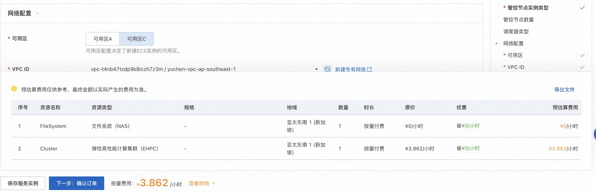
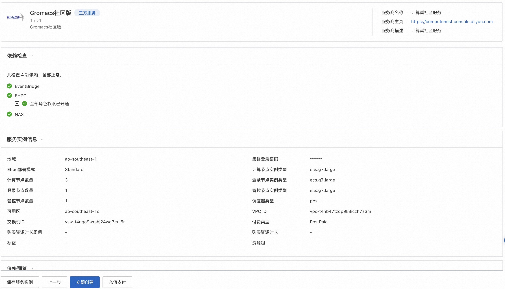

# Gromacs Ehpc计算巢快速部署


>**免责声明：**本服务由第三方提供，我们尽力确保其安全性、准确性和可靠性，但无法保证其完全免于故障、中断、错误或攻击。因此，本公司在此声明：对于本服务的内容、准确性、完整性、可靠性、适用性以及及时性不作任何陈述、保证或承诺，不对您使用本服务所产生的任何直接或间接的损失或损害承担任何责任；对于您通过本服务访问的第三方网站、应用程序、产品和服务，不对其内容、准确性、完整性、可靠性、适用性以及及时性承担任何责任，您应自行承担使用后果产生的风险和责任；对于因您使用本服务而产生的任何损失、损害，包括但不限于直接损失、间接损失、利润损失、商誉损失、数据损失或其他经济损失，不承担任何责任，即使本公司事先已被告知可能存在此类损失或损害的可能性；我们保留不时修改本声明的权利，因此请您在使用本服务前定期检查本声明。如果您对本声明或本服务存在任何问题或疑问，请联系我们。

## 概述

GROMACS（GROningen MAchine for Chemical Simulations）是一款通用软件，用于对具有数百万颗粒子的系统进行基于牛顿运动方程的分子动力学模拟。
GROMACS主要用于生物化学分子，如蛋白质、脂质等具有多种复杂键合相互作用的核酸分析。GROMACS计算典型的模拟应用，如高效地计算非键合相互作用，许多研究人员用其研究非生物系统的聚合物。
GROMACS支持分子动力学的常见算法，可以采用GPU来加速核心计算过程。更多信息，请参见[GROMACS官网](https://www.gromacs.org/)。
本文介绍如何使用计算巢快速部署Gromacs。


## 前提条件

部署Gromacs社区版服务实例，需要对部分阿里云资源进行访问和创建操作。因此您的账号需要包含如下资源的权限。
  **说明**：当您的账号是RAM账号时，才需要添加此权限。

  | 权限策略名称                          | 备注                     |
  |---------------------------------|------------------------|
  | AliyunECSFullAccess             | 管理云服务器服务（ECS）的权限       |
  | AliyunEHPCFullAccess            | 管理弹性高性能计算（EHPC）的权限     |
  | AliyunNASFullAccess             | 管理文件存储（NAS）的权限         |
  | AliyunVPCFullAccess             | 管理专有网络（VPC）的权限         |
  | AliyunROSFullAccess             | 管理资源编排服务（ROS）的权限       |
  | AliyunComputeNestUserFullAccess | 管理计算巢服务（ComputeNest）的用户侧权限 |


## 计费说明

Gromacs社区版在计算巢部署的费用主要涉及：

- 弹性高性能计算集群（EHPC）费用
- 文件系统（NAS）费用
- 流量带宽费用

## 部署架构


- 部署由一个ehpc集群组成，ehpc集群中包括台manager节点、schedule节点和compute节点
- 服务使用nas-cpfs构建高性能共享文件系统

## 参数说明
| 参数组       | 参数项      | 说明                                           |
|-----------|----------|----------------------------------------------|
| 服务实例      | 服务实例名称   | 长度不超过64个字符，必须以英文字母开头，可包含数字、英文字母、短划线（-）和下划线（_）|
|           | 地域       | 服务实例部署的地域                                    |
|           | 付费类型     | 资源的计费类型：按两付费和包年包月                            |
| EHPC集群配置  | 集群登录密码   | 长度8-30，必须包含三项（大写字母、小写字母、数字、 ()`~!@#$%^&*-+=&#124;{}[]:;'<>,.?/ 中的特殊符号） | 
|           | Ehpc部署模式 | Tiny，Simple，Standard                         |
|           | 计算节点实例类型 | 可用区下可以使用的计算节点规格                              |
|           | 计算节点数量   | 计算节点数量, 可选值: 1-99                            |
|           | 登录节点实例类型 | 可用区下可以使用的登录节点规格                              |
|           | 管控节点数量   | 管控节点数量, 可选值: 1,2,4                           |
| EHPC集群用户配置 | 用户密码     | 长度8-30，必须包含三项（大写字母、小写字母、数字、()~!@#$%^&*-_+=\|{}[]:;'/<>,.?/中的特殊符号） |
|                | 用户名称     | 登录集群所用的用户名，默认为gromacs                        |
| 网络配置      | 可用区      | ECS实例所在可用区                                   |
|           | VPC ID   | 资源所在VPC                                      |
|           | 交换机ID    | 资源所在交换机                                      |

## 部署流程
1. 访问计算巢Gromacs社区版[部署链接](https://computenest.console.aliyun.com/user/cn-hangzhou/serviceInstanceCreate?ServiceId=service-a44c0fa4bf4947278642)
，按提示填写部署参数：
    

2. 参数填写完成后可以看到对应询价明细，确认参数后点击**下一步：确认订单**。
   

3. 确认订单完成后同意服务协议并点击**立即创建**
   进入部署阶段。
    

## 使用流程
### 步骤一：通过控制台连接集群
1. 登录[弹性高性能计算控制台](https://ehpc.console.aliyun.com)。
2. 在顶部菜单栏左上角处，选择地域。
3. 在左侧导航栏，单击**集群**。
4. 在**集群**页面，找到在计算巢部署好的目标集群，单击**远程连接**。
    

5. 在**远程连接**页面，输入集群用户名、登录密码和端口，单击**ssh连接**。

### **步骤二：提交作业**

1.  执行以下命令下载并解压算例。本文使用水分子运动算例作为示例。

    wget https://public-ehpc-package.oss-cn-hangzhou.aliyuncs.com/water_GMX50_bare.tar.gz
    
    tar xzvf water_GMX50_bare.tar.gz
    
    chown -R gromacs water-cut1.0_GMX50_bare
    
    chgrp -R users water-cut1.0_GMX50_bare
    
2.  执行以下命令创建作业脚本文件，脚本文件命名为gmx.pbs。

    ```
    vim gmx.pbs
    ```
    
    作业脚本内容示例如下：

     \#!/bin/sh
    
    \#PBS -j oe
    
    \#PBS -l select=3:ncpus=4:mpiprocs=4
    
    \#PBS -q workq

    \#select=3：指定需要3个节点。
    
    \#ncpus=4：指定每个节点需要4个CPU核心。
    
    \#mpiprocs=4：指定每个节点使用4个MPI进程。
    
    \#module命令依赖的环境变量
    
    export MODULEPATH=/opt/ehpcmodulefiles/
    
    module load gromacs-gpu/2018.1
    
    module load openmpi/3.0.0
    
    module load cuda-toolkit/9.0
    
    export OMP_NUM_THREADS=1

    cd /home/gromacs/water-cut1.0_GMX50_bare/0096
    
    \#前处理过程，生成tpr格式输入文件
    
    /opt/gromacs-gpu/2018.1/bin/gmx_mpi grompp -f pme.mdp -c conf.gro -p topol.top -o topol_pme.tpr

     \#-ntomp指定每个进程开启的OpenMP线程数，-nsteps指定模拟迭代步数
    
      mpirun -np 4 /opt/gromacs-gpu/2018.1/bin/gmx_mpi mdrun -ntomp 1 -nsteps 100000 -pin on -s topol_pme.tpr

3.  执行以下命令提交作业。

    ```
    qsub gmx.pbs
    ```

    预期返回如下，表示生成的作业ID为0.scheduler。

    ```
    0.scheduler
    ```

### **步骤三：查看作业结果**

1.  查看作业运行情况。

    ```
    qstat -x 0.scheduler
    ```
    
    预期返回如下，当返回信息中S为R时，表示作业正在运行中；当返回信息中S为F时，表示作业已经运行结束。
    
    
2.  使用VNC可视化查看作业结果。
    1. 打开VNC。 控制台操作时系统会自动打开集群安全组 12016 端口。 
       1. 在[弹性高性能计算控制台](https://ehpc.console.aliyun.com)的左侧导航栏，单击**集群**。 
       2. 在**集群**页面，找到目标集群，单击**更多** &gt; **VNC**。
          
       3. 使用VNC远程连接可视化服务。具体操作，请参见[连接可视化服务](https://help.aliyun.com/zh/e-hpc/user-guide/use-vnc-to-manage-a-visualization-service#section-bf6-eyn-edu)。
    2. 在VNC窗口中，选择**Application&gt;System Tools&gt;Terminal**。
    3. 运行`/opt/vmd/1.9.3/vmd`打开VMD软件。
    4. 在VMD Main对话框中，选择**File &gt; New Molecule...**。
    5. 单击**Filename**处对应的**Browse...**，选择结果文件conf.gro。
    6. conf.gro文件所在路径为/home/gromacs/water-cut1.0_GMX50_bare/0096/conf.gro。 
    7. 单击**Load**，可在**VMD 1.9.3 OpenGL Display**窗口查看可视化结果。
        
